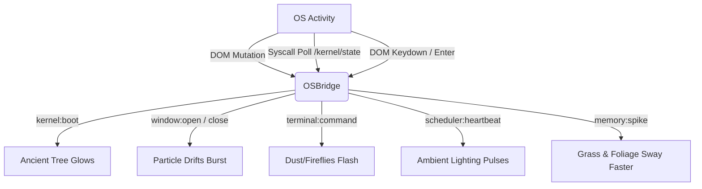

<p align="center">
  
  
  
  
  
</p>

# RuneOS v1.0 — Living Desktop Environment

**RuneOS is a browser-native operating system experience powered by a real C kernel compiled to WebAssembly, set against a dynamic, hardware-accelerated HD-2D hybrid rendering pipeline.**

Unlike traditional flat portfolio websites, RuneOS runs a genuine monolithic operating system kernel inside a WebAssembly sandbox, paired with a custom graphical desktop environment. In version 2.1, the desktop background has been upgraded to a premium **HD-2D hybrid background engine** that translates desktop activities, kernel events, and scheduler heartbeats into real-time visual atmosphere.

---

## 🎨 Art Style & Visual Direction

The visual style of RuneOS v1.0 is designed to feel like a **premium, interactive macOS wallpaper** rather than a traditional game. It avoids generic, low-poly 3D assets, dragons, castles, and flashy fantasy elements in favor of a **calm, clean, nature-inspired engineering aesthetic**.

### 1. The HD-2D Hybrid Philosophy
The environment utilizes a "2D-in-3D" pop-up book composition model. There are **zero** visible 3D environment meshes. Instead, the background consists of high-quality hand-painted digital paintings applied as transparent textures onto flat planes (billboards) positioned at various depths in a 3D coordinate space. This creates an incredible sense of painterly depth through camera parallax while keeping the GPU workload extremely light.

*   **Studio Ghibli Aesthetic**: Inspired by Ghibli and Octopath Traveler illustrations. Warm earth tones, lush forest greens, atmospheric mist, and hand-drawn line art.
*   **Minimalist Framing (Rule of Thirds)**: The hero element—the ancient tree—is positioned on the left third of the viewport. This leaves the center and right-hand side of the screen uncluttered, providing a clean canvas for terminal windows and file managers.
*   **Timeless Serenity**: Soft particle drifts, volumetric light rays, and time-of-day coloring ensure the background serves as a secondary, non-distracting element that highlights the system's interactive features.

---

## 📐 Architecture Overview

```
┌────────────────────────────────────────────────────────────────────────┐
│                           BROWSER RUNTIME                              │
│                                                                        │
│  ┌──────────────────────────────────────────────────────────────────┐  │
│  │                     PRESENTATION LAYER (DOM)                     │  │
│  │       webpage.html   ──   index.css   ──   Desktop Windows       │  │
│  └───────────────────────────────┬──────────────────────────────────┘  │
│                                  │ MutationObserver / Events           │
│  ┌───────────────────────────────▼──────────────────────────────────┐  │
│  │                    OS BRIDGE & EVENTS (JS)                       │  │
│  │  OSBridge.js ── Polls /kernel/state & catches window actions     │  │
│  └───────────────────────────────┬──────────────────────────────────┘  │
│                                  │ Emitted Signals                     │
│  ┌───────────────────────────────▼──────────────────────────────────┐  │
│  │                     WALLPAPER ENGINE (THREE.JS)                  │  │
│  │                                                                  │  │
│  │  Wallpaper3D.js ── Orchestrator & requestAnimationFrame loop     │  │
│  │  SceneCore.js ──── Renderer, perspective camera, Bloom pass      │  │
│  │  Lighting.js ───── Dynamic sun, shadow maps, volumetric rays     │  │
│  │  PaintedEnv.js ─── Sky shader, mountain, forest, tree billboards  │  │
│  │  SpriteParticles.js ─ Dust, pollen, and fireflies (GPU Points)   │  │
│  │  EasterEggs.js ─── Parallax birds, shooting stars                │  │
│  └───────────────────────────────┬──────────────────────────────────┘  │
│                                  │ cwrap() / ccall()                   │
│  ┌───────────────────────────────▼──────────────────────────────────┐  │
│  │                     KERNEL LAYER (C → WASM)                      │  │
│  │                                                                  │  │
│  │  kernel_wasm.c ── Emscripten export layer                        │  │
│  │  core/kernel.c ── Syscall dispatch, scheduler, processes          │  │
│  │  core/vfs.c ───── Virtual filesystem tree                         │  │
│  └──────────────────────────────────────────────────────────────────┘  │
└────────────────────────────────────────────────────────────────────────┘
```

---

## 🖼️ The HD-2D Wallpaper Engine

The wallpaper engine represents a complete rewrite of the desktop background renderer. It implements a layered parallax composition that responds directly to user movements and system triggers.

### 1. Parallax Depth Layering
A real `THREE.PerspectiveCamera` frames the scene. As the user moves their mouse, the camera gently rotates by **2 to 3 degrees**, causing the flat planes to translate at differing speeds based on their distance along the Z-axis:

| Layer Name | Asset / Texture | Z-Position | Parallax Ratio | Purpose |
|---|---|---|---|---|
| **Sky Gradient** | Procedural Fragment Shader | `-100` | `0.00` | Smooth sky color shifts across day phases |
| **Mountains** | `forest_silhouette.png` (re-scaled) | `-60` | `0.10` | Deep backdrop silhouette |
| **Distant Forest** | `forest_silhouette.png` | `-40` | `0.20` | Intermediate layer for forest density |
| **Hero Tree** | `hero_tree.png` | `-15` | `0.40` | The giant hand-painted focal point (left-third) |
| **Grass Midground** | `grass_layer.png` | `-16` | `0.35` | Clatter layers framing the root base |
| **Grass Foreground**| `grass_layer.png` | `-5` | `0.60` | Tall blades that frame the bottom-right viewport |
| **Fog Cards** | Programmatic Radial Alpha Canvas | `-10 to 5` | `0.70 - 0.90` | Ambient mist drifting horizontally |
| **GPU Particles** | Dynamic canvas-textured points | `Various` | `0.90` | Airborn pollen, dust, and fireflies |

### 2. Lighting, Shadows & Post-Processing
The environment uses a physical renderer with dynamic atmospheric details to enhance the illustrated layers:
*   **Directional Sun & Shadows**: A `THREE.DirectionalLight` acts as the sun/moon. The tree, grass, and forest billboards utilize `THREE.MeshStandardMaterial` with `alphaTest: 0.3` and `castShadow = true`. This forces Three.js to clip the shadow-map generation to match the transparency of the illustrated PNGs, rendering detailed, organic leaf shadows.
*   **Volumetric Rays (God Rays)**: Simulated using a group of tilted planes with custom linear alpha gradients and `THREE.AdditiveBlending`. They hover near the tree canopy and glow subtly.
*   **UnrealBloomPass**: A post-processing composer pass configured with low strength (`0.3`) and high threshold (`0.6`) to bloom glowing fireflies, sun rays, and morning mist highlights without washing out the desktop interface.
*   **Time of Day Lighting cycles**: An internal clock tracks the real-world system hour, transitioning the environment colors across four key palettes:
    *   *Morning*: Golden-amber sun, soft blue-grey ambient fill, volumetric ray opacity at maximum (`0.25`).
    *   *Afternoon*: Crisp white sun, bright sky-blue ambient fill, low fog density.
    *   *Evening*: Deep orange sun, purple-red ambient fill, high volumetric ray opacity (`0.3`).
    *   *Night*: Cool indigo moonlight, low-light ambient fill, high fog density, firefly glow active.

---

## 🔌 OS-to-Environment Event Bridge (`OSBridge.js`)

RuneOS decouples kernel execution from graphics performance. The wallpaper engine acts as a **passive observer** of the operating system state via the `OSBridge` module. It listens to DOM mutations and polls kernel stats to trigger environmental reactions:



*   **Tree Glow (`kernel:boot`)**: When the WASM kernel finishes loading, the hero tree canopy's emissive channel is set to high and decays slowly over 2 seconds.
*   **Foliage Sway (`memory:spike`)**: High memory usage reported in `/kernel/state` increases the wind multiplier, causing the grass layers and tree billboard to sway with higher frequency.
*   **Atmospheric Pulse (`scheduler:heartbeat`)**: Every process scheduling loop heartbeat triggers a brief ambient brightness pulse.
*   **Particle Boost (`terminal:command`)**: Running a terminal command increases particle movement speed and opacity, simulating leaves or dust kicked up by command executions.

---

## ⚙️ Kernel Internals (C & WebAssembly)

The underpinnings of RuneOS rely on a real C kernel compiled to WebAssembly via Emscripten.

### 1. Virtual Filesystem (VFS)
The VFS is a tree structures composed of `vfs_node_t` structs. It defines file handling via function pointers:
```
/
├── proc/
│   └── ps            → Computes running process list on-the-fly
├── kernel/
│   └── state         → Exposes real-time scheduler & memory metrics
├── ai/
│   └── input         → Endpoint for passing terminal input into VFS pipeline
└── home/             (Writable user-space)
    ├── resume.txt    → Embedded text resume
    └── projects/     → Writable user project directory
```

### 2. Syscall Dispatcher
All input and shell actions are parsed and executed through C syscall entries:
*   `SYS_SPAWN` (1) / `SYS_EXIT` (2) / `SYS_REAP` (3): Process lifecycle control.
*   `SYS_READ` (4) / `SYS_WRITE` (5): Basic VFS I/O operations.
*   `SYS_MKDIR` (6) / `SYS_LS` (7) / `SYS_TOUCH` (8): Directory and file management.

---

## 📁 Project Structure

```
portfolio-website/
├── webpage.html              # HTML shell injecting WebAssembly & wallpaper canvas
├── css/
│   └── index.css             # Main stylesheet, styling desktop panels & window animations
│
├── wasm/
│   ├── kernel.js             # Emscripten glue layer
│   └── kernel.wasm           # Compiled C binary
│
├── js/
│   ├── main.js               # Event routing and startup orchestrator
│   ├── System.js             # VFS initial mounting, clock, and boot loop
│   ├── WindowManager.js      # Panel drag, maximize, and focus manager
│   ├── AppManager.js         # Launches and renders app widgets (Terminal, Files, etc.)
│   ├── Wallpaper3D.js        # Dynamic Wallpaper orchestrator
│   │
│   └── wallpaper/            # Wallpaper Submodules
│       ├── SceneCore.js      # Three.js core renderer, UnrealBloom composer, camera parallax
│       ├── PaintedEnvironment.js # Illustrated billboard planes (tree, grass, mountains)
│       ├── SpriteParticles.js # Point particle systems (dust, pollen, fireflies)
│       ├── Lighting.js       # Dynamic sun, dynamic shadow maps, god rays, exp fog
│       ├── OSBridge.js       # Non-invasive DOM & VFS state listener
│       └── EasterEggs.js     # Parallax birds and shooting stars
│
└── assets/
    ├── resume.html           # HTML formatted resume payload
    └── wallpaper/            # Hand-painted environment assets
        ├── hero_tree.png         # Main tree transparent billboard
        ├── forest_silhouette.png # Mountains and background forest layer
        └── grass_layer.png       # Bottom-screen grass layer
```

---

## 🚀 Local Development & Execution

Because the graphics engine loads PNG textures and the kernel loads WebAssembly via asynchronous JavaScript modules, the project **must be run over an HTTP server** (due to browser CORS restrictions on `file://` protocols).

### Serve the Directory
You can serve the directory locally using Python:
```bash
python3 -m http.server 8080
```
Open your browser and navigate to `http://localhost:8080/webpage.html`.

### Recompiling the Kernel
If you make changes to the C code in `kernel/`:
```bash
cd kernel
make clean && make
```
This output compiles directly into `wasm/kernel.js` and `wasm/kernel.wasm`.
